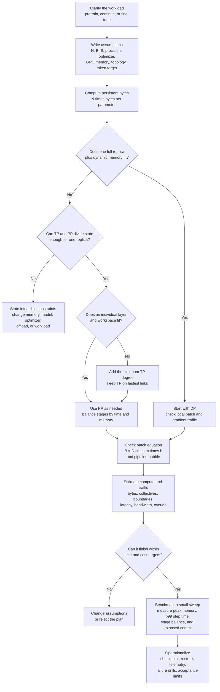

# Choosing data, tensor, and pipeline parallelism

*A first-principles guide to memory, communication, and reliable training.*

A GPU can perform an operation only when its inputs are available and its intermediate results fit in memory. Splitting a model across GPUs changes where those inputs live. The computation gets smaller, but some dependencies become network transfers.

That is the central tradeoff. To choose a layout, answer three questions in order:

1. Can every GPU hold the state that is simultaneously live?
2. Does dividing the work save more time than the resulting communication and waiting consume?
3. Can the job sustain that performance through stragglers, checkpoints, and recovery?

A useful design review ends with numbers for these questions and a list of measurements that could change the decision.

## 1. Scope and assumptions

We consider synchronous training of a dense model. Each optimizer update uses a fixed global batch and the same parameter version across its microbatches. GPUs are homogeneous unless we explicitly discuss imbalance. Tensor shapes and sequence lengths are fixed for the worked example.

The three strategies are:

| Strategy | What is divided? | What must communicate? |
| --- | --- | --- |
| Data parallelism, DP | Training examples | Replicas combine gradients for corresponding parameters. |
| Tensor parallelism, TP | Operations and parameter tensors inside a layer | Shards exchange or combine intermediate results. |
| Pipeline parallelism, PP | The sequence of layers | Adjacent stages exchange activations and their gradients. |

**DP means replicated training state throughout this guide.** In a combined layout, a *replica* is a complete model spread across a TP×PP group. DP duplicates that entire group. Corresponding GPUs in different replicas synchronize the gradients of their matching parameter shards.

TP and PP distribute ownership within a replica. DP distributes examples between replicas. A communication operation such as AllReduce is a mechanism used by these strategies, not an additional strategy.

We allow gradient accumulation and activation recomputation as memory/scheduling choices. We do not introduce other sharding strategies. If none of DP, TP, and PP produces a feasible layout under the stated constraints, the correct conclusion is that these constraints have no feasible solution.

### Notation and units

Equations use GitHub-flavored Markdown math: `$...$` for inline expressions and
`$$...$$` for display equations.

| Symbol | Meaning |
| --- | --- |
| $G$ | Total GPUs allocated to the job |
| $D$, $T$, $K$ | DP degree, TP degree, and PP stages |
| $N$ | Number of unique model parameters |
| $L$, $h$, $S$ | Transformer blocks, hidden width, sequence length |
| $B$ | Global batch: sequences per optimizer update |
| $b$ | Microbatch: sequences processed together by one model replica |
| $m$ | Microbatches accumulated per replica per update |
| $q_w$, $q_g$, $q_o$ | Bytes per parameter for weights, gradients, and optimizer/master state |
| $q_a$ | Bytes per activation element communicated |
| $\alpha$, $\beta$ | Communication startup time and effective bandwidth |

For equal microbatches and identical replica schedules:

$$
\begin{aligned}
G &= D T K, \\
B &= Dmb, \\
\text{tokens per optimizer update} &= BS.
\end{aligned}
$$

TP and PP do not multiply the batch. The GPUs in one model replica cooperate on the same examples.

We use decimal units: $1\ \mathrm{GB}=10^9$ bytes,
$1\ \mathrm{GB/s}=10^9$ bytes/s, and
$1\ \mathrm{TFLOP/s}=10^{12}$ FLOP/s. Device tools may report GiB:
$1\ \mathrm{GiB}=2^{30}$ bytes. Convert before comparing a memory estimate
with a reported limit.

## 2. Preserve the training calculation

Parallel execution must still compute the intended update. This is easiest to
see with an objective that averages losses over $B$ equally weighted examples:

$$
\nabla\mathcal{L}
= \frac{1}{B}\sum_{j=1}^{B}\nabla\ell_j.
$$

In DP, each replica processes a disjoint subset. If each processes exactly
$B/D$ examples and computes their mean gradient, averaging those $D$ replica
gradients gives the global mean.

If replicas contain different numbers of valid tokens, an average of replica means is generally wrong. Sum the appropriately weighted gradient contributions and normalize by the total number of valid tokens. Padding masks, uneven batches, and gradient accumulation can all change the required denominator.

Accumulating $m$ equally sized microbatch mean gradients also requires
normalization by $m$ before the intended update. Clipping, loss scaling, and
optimizer steps must respect the same update boundary. TP partial sums
reconstruct a single operation; they are not a further average over training
examples.

Changing $b$ while keeping $B$ fixed can preserve the mathematical objective,
but may change floating-point rounding, random-number consumption, or
batch-dependent operations. Changing $B$ changes the optimization experiment.
Record it as a training change, not merely a hardware setting.

## 3. Memory: account for what is live together

The actual constraint is the largest instantaneous allocation on any GPU:

For every GPU $i$:

$$
\begin{aligned}
M_i^{\mathrm{peak}}
&= \max_t \Bigl(
M_{i,\mathrm{weights}}(t)
+ M_{i,\mathrm{gradients}}(t)
+ M_{i,\mathrm{optimizer}}(t) \\
&\qquad
+ M_{i,\mathrm{activations}}(t)
+ M_{i,\mathrm{communication}}(t)
+ M_{i,\mathrm{workspace}}(t)
+ M_{i,\mathrm{runtime}}(t)
\Bigr), \\
M_i^{\mathrm{peak}} &\le M_i^{\mathrm{usable}}.
\end{aligned}
$$

Adding the separate maximum of every category gives a conservative estimate, because those maxima may occur at different times. Omitting a category gives a potentially unsafe estimate. Persistent storage, live allocation, and allocator-reserved memory are different quantities; compare them consistently.

### 3.1 Persistent training state

Consider this **specific** mixed-precision optimizer configuration:

| State | Bytes per parameter |
| --- | ---: |
| Low-precision training weights | 2 |
| Low-precision gradient buffer | 2 |
| FP32 master weights | 4 |
| Two FP32 optimizer moment buffers | 8 |
| **Total** | **16** |

Thus an 8-billion-parameter model has:

$$
M_{\mathrm{persistent}}
= 8\times10^9\times16\ \mathrm{bytes}
= 128\ \mathrm{GB}.
$$

This assumes all listed buffers exist. A configuration with FP32 gradients would need 18 bytes per parameter under the other same assumptions. Some implementations omit a master copy or introduce additional temporary copies. Inspect the actual optimizer and gradient representation.

Under ideal partitioning:

$$
M_{\mathrm{persistent/GPU}}
\approx \frac{N(q_w+q_g+q_o)}{TK}.
$$

$D$ is absent. Replication does not reduce the state owned by a GPU. Increasing
DP can reduce activation memory when it permits a smaller microbatch, but it
cannot fix an oversized persistent replica.

The division by $TK$ is only a starting estimate. Count replicated parameters,
uneven stages, padding, shared/tied weights, and any duplicated optimizer state.
PP requires balancing by bytes as well as time.

### 3.2 Activations are not parameter memory

One hidden-state tensor contains:

$$
M_{\mathrm{hidden}} = bShq_a.
$$

For $b=1$, $S=2048$, $h=4096$, and $q_a=2$, that is
$16{,}777{,}216$ bytes, approximately $16.8\ \mathrm{MB}$. This is the size of
one tensor, not the total activation footprint of a block.

Backward may need multiple saved tensors per layer: inputs to matrix multiplications, nonlinearities, normalization statistics, and attention intermediates. A coarse inventory is:

$$
M_{\mathrm{saved}}
\approx n_{\text{in flight}}
\sum_{\ell\in\text{local layers}}
M_{\mathrm{saved},\ell,\mathrm{microbatch}}.
$$

Make the assumptions behind “saved bytes” explicit. Materializing attention
scores can introduce storage proportional to $bH S^2$, where $H$ is the
number of attention heads. A kernel that avoids retaining that matrix has a
different memory model. A constant multiplier of $bSh$ cannot describe both
implementations over all sequence lengths.

Gradient accumulation does not inherently retain $m$ complete computation
graphs. Without PP, forward/backward can run for each microbatch and free its
activations before the next microbatch. PP can keep several microbatches
awaiting backward; the schedule determines how many are live.

Activation recomputation saves selected values and recomputes others during backward. It exchanges activation storage for additional work. Charge that work to the compute budget.

### 3.3 What constitutes a memory blocker?

- **DP:** the full replica's persistent state must fit on each GPU, plus the dynamic footprint.
- **TP:** supported parameter and operation shards must fit. Some activation tensors remain replicated; do not divide every category by $T$.
- **PP:** each assigned stage must fit. Ordinary layer-boundary PP leaves a layer intact. If one indivisible layer exceeds the budget, adding PP stages does not solve that problem.

TP can also reduce total model state when individual layers already fit. It is not reserved for oversized layers. PP can distribute depth only if a legal partition satisfies both peak memory and time constraints.

## 4. Compute: derive the work before dividing it

For a matrix multiplication:

$$
X\in\mathbb{R}^{n\times h},\qquad
W\in\mathbb{R}^{h\times f},\qquad
Y=XW\in\mathbb{R}^{n\times f}.
$$

$$
\begin{aligned}
F_{\mathrm{forward}} &\approx 2nhf, \\
F_{\nabla X} &\approx 2nhf, \\
F_{\nabla W} &\approx 2nhf, \\
F_{\mathrm{training}} &\approx 6nhf.
\end{aligned}
$$

We count one multiply and one add as two FLOPs. These costs assume both input and weight gradients are required and omit bias, nonlinearities, and optimizer work.

For dense parameter matrix multiplications across the model, a common first estimate is:

$$
F_{\mathrm{step}} \approx 6NBS.
$$

This assumes each counted parameter participates once per token in a matrix multiplication, and forward/backward dominate. Attention's sequence-to-sequence products add work that is not captured by parameter count. Long sequences, embeddings, unusual blocks, and recomputation can make the estimate inaccurate. Use a per-operation inventory when those terms matter.

Given measured sustained compute throughput $C_{\mathrm{eff}}$ per GPU on the
relevant local shapes:

$$
T_{\mathrm{compute}}^{\mathrm{ideal}}
= \frac{F_{\mathrm{step}}}{G C_{\mathrm{eff}}}.
$$

Use sustained throughput for those kernels, not the device's advertised peak.
Increasing TP narrows local matrices. Increasing DP at fixed $B$ can require a
smaller $b$ or fewer microbatches. Changing either can change
$C_{\mathrm{eff}}$.

“Half the FLOPs per GPU” implies “half the time” only if kernel efficiency remains constant and there are no new waits.

## 5. Communication: identify bytes, frequency, and dependencies

For a single transfer of $V$ bytes on an otherwise available link:

$$
T_{\mathrm{transfer}} \approx \alpha + \frac{V}{\beta}.
$$

Use effective payload bandwidth on the actual route. Shared NICs, link oversubscription, concurrent collectives, host staging, and protocol overhead can reduce it.

A ring AllReduce over $p$ ranks provides a useful derivation. Each rank sends
$p-1$ chunks in a reduction phase and $p-1$ chunks in a distribution phase.
Each chunk has $X/p$ bytes:

$$
V_{\mathrm{ring/rank}}
= 2\frac{p-1}{p}X.
$$

$$
T_{\mathrm{ring}}(p,X)
\approx 2(p-1)\alpha
+ \frac{2(p-1)X}{p\beta}.
$$

This counts sent bytes. Each rank receives a comparable volume. Do not double the time estimate merely because a full-duplex link can send and receive simultaneously. Conversely, do not use a bidirectional aggregate bandwidth number as a one-direction bandwidth.

The ring formula assumes a regular ring, equally sized chunks, sustained link bandwidth, and negligible local reduction cost. Real libraries select and tune algorithms. The formula explains a cost model; it does not identify the algorithm used in a particular run.

### Overlap must respect dependencies

A gradient bucket can communicate while backward computes a different bucket. A TP output needed by the next matrix multiplication cannot be hidden behind that next multiplication. Independent work may still overlap part of the transfer.

Do not assume either perfect overlap or zero overlap without saying so. Summing every kernel and communication duration can exceed wall-clock time because activities overlap. A dependency timeline determines the exposed delay.

## 6. DP: why it scales until it does not

Each replica computes local gradients, combines them with other replicas, and applies the same optimizer update. With gradient accumulation, synchronization can be deferred until the final backward pass of the update. That is an explicit implementation choice; synchronizing every microbatch multiplies communication frequency. PyTorch's [DDP tuning guidance](https://docs.pytorch.org/tutorials/recipes/recipes/tuning_guide) describes this distinction and the use of `no_sync()`.

With one effective gradient synchronization per update and balanced model shards:

$$
X_{\mathrm{DP}} \approx \frac{Nq_g}{TK}.
$$

$$
V_{\mathrm{DP/rank/update}}
\approx 2\frac{D-1}{D}X_{\mathrm{DP}}.
$$

For pure DP, $T=K=1$, so each rank communicates the full gradient. In a
hybrid, a DP group connects matching shards across replicas, not every GPU in
the job.

Bucketing changes startup count and overlap. If a payload is split into many small buckets, applying one startup charge to the whole payload underestimates latency. Gradient accumulation also changes the size of the overlap window: earlier microbatches cannot hide a synchronization that starts only during the final backward pass.

DP communication per update is mostly determined by parameter-gradient size. Compute per replica grows with tokens processed per update. This explains why increasing local work can amortize DP synchronization, subject to memory and training constraints.

**DP limit at fixed batch:** because $m=B/(Db)$, increasing $D$ reduces $m$
if $b$ is held fixed. For $B=32$ and $b=1$, $D$ cannot exceed 32 under this
equal, nonempty batch assumption. Well before that limit, synchronization may
dominate.

## 7. TP: derive a useful partition rather than gathering blindly

Consider an MLP with an elementwise nonlinearity:

$$
H=\phi(XW_1),\qquad Y=HW_2,
$$

where $W_1\in\mathbb{R}^{h\times f}$ and
$W_2\in\mathbb{R}^{f\times h}$.

Split $W_1$ by output columns and $W_2$ by matching input rows across $T$
ranks:

```text
Rank i owns:
    W1_i: [h, f/T]
    W2_i: [f/T, h]

Rank i computes:
    H_i = phi(X W1_i)       # local intermediate [n, f/T]
    Y_i = H_i W2_i          # partial output [n, h]

Complete output:
    Y = sum over i of Y_i
```

There is no need to assemble the full expanded $H$ between these two
multiplications: the second multiplication consumes the corresponding local
shard. An AllReduce can sum the partial outputs and return the result to every
TP rank. In backward, the input-gradient contributions from the
column-partitioned multiplication must also be combined.

This paired layout uses one AllReduce in forward and one in backward for the MLP, under replicated input/output conventions. A similarly partitioned attention sublayer adds another pair in a conventional Transformer layout. The original [tensor-parallel Transformer design](https://arxiv.org/abs/1909.08053) uses these paired partitions.

### A concrete TP cost model

Assume all of the following:

- A Transformer block has the attention and MLP layout just described.
- Hidden states at the relevant boundaries are replicated across the TP group.
- Each block uses four AllReduces total per microbatch, counting forward and backward together.
- Each AllReduce has payload $X=bShq_a$ bytes.
- There is no recomputation that adds further communication.
- Each stage has $L/K$ blocks.

Then:

$$
C_{\mathrm{TP/update}}
= 4\frac{L}{K}m.
$$

$$
V_{\mathrm{TP/rank/update}}
\approx
4\frac{L}{K}m
\left(2\frac{T-1}{T}X\right).
$$

$$
T_{\mathrm{TP}}^{\text{no overlap}}
\approx
4\frac{L}{K}m\,T_{\mathrm{ring}}(T,X).
$$

For $T=1$, TP communication is zero. These counts describe this specific
layout, not every TP implementation. Additional redistribution, different
attention layouts, or recomputation change the count. Inventory the actual
tensors before using the formula.

### Why fast links and sufficiently large shards matter

As $T$ increases, local matrix work often falls approximately as $1/T$. The
bandwidth factor $(T-1)/T$ tends toward one, and the ring startup term
increases. Communication does not shrink at the same rate as compute.

This is why TP is usually a good candidate for the fastest connected device group. It is also why the smallest feasible TP degree is a useful starting point, although benchmarking may favor a larger degree.

Feasibility requires supported partitions and kernels. Relevant matrix dimensions or attention head assignments must support the chosen degree, possibly with padding. All TP ranks must execute compatible collectives in the same order. Exact divisibility and equal-sized shards are simplifying assumptions, not universal mathematical requirements.

## 8. PP: derive the bubble and then ask what fits

A pipeline divides the model into stages. Each stage receives a microbatch's activation, computes its local layers, and sends the result onward. Backward sends the corresponding activation gradient in the reverse direction.

For a boundary tensor in $\mathbb{R}^{b\times S\times h}$:

$$
\begin{aligned}
X_{\mathrm{boundary}} &= bShq_a, \\
V_{\mathrm{forward/microbatch}} &= X_{\mathrm{boundary}}, \\
V_{\mathrm{backward/microbatch}} &\approx X_{\mathrm{boundary}}, \\
V_{\mathrm{boundary/update}} &\approx 2mX_{\mathrm{boundary}}.
\end{aligned}
$$

That last expression describes a single logical full-tensor transfer per
direction. In a TP×PP implementation, determine whether the tensor is
partitioned across boundary links, sent once and redistributed, or duplicated
on $T$ corresponding rank pairs. With duplicated full tensors, aggregate
boundary traffic is $T$ times larger. Count the actual send operations and
shared NIC load.

### 8.1 Deriving fill and drain overhead

Take a simple synchronous schedule: run all forward microbatches, then all
backward microbatches, then update weights. Assume $K$ balanced stages, forward
time $f$ per stage per microbatch, backward time $r$, zero communication, and
no optimizer overhead.

Forward takes $m+K-1$ slots of duration $f$: the first output traverses $K$
stages, then each subsequent output appears one slot later. Backward takes the
same slot count with duration $r$.

$$
\begin{aligned}
T_{\mathrm{pipeline}} &= (m+K-1)(f+r), \\
T_{\mathrm{busy/stage}} &= m(f+r), \\
U &= \frac{m}{m+K-1}, \\
f_{\mathrm{bubble}} &= \frac{K-1}{m+K-1}, \\
\frac{T_{\mathrm{bubble}}}{T_{\mathrm{busy}}} &= \frac{K-1}{m}.
\end{aligned}
$$

Bubble fraction and overhead relative to useful time have different
denominators. For $K=4$ and $m=4$, occupancy is $4/7\approx57\%$; for $m=32$,
it is $32/35\approx91\%$.

This derivation applies to the stated schedule and balance assumptions. Other schedules can alternate forward and backward to reduce live activations or use different partitions to change idle time. Do not use one schedule's memory estimate with another schedule's timing formula. The [pipeline analysis in the large-scale training study](https://arxiv.org/abs/2104.04473) discusses these scheduling and communication tradeoffs.

To target occupancy $u$ in this simple model:

$$
m \ge \frac{u(K-1)}{1-u}.
$$

For $u=0.90$:

$$
m \ge 9(K-1).
$$

Combine this with the batch equation:

$$
\frac{B}{Db} \ge 9(K-1).
$$

DP and PP therefore compete for the same fixed batch budget. Adding DP replicas reduces the microbatches available to fill each pipeline. Splitting into smaller microbatches may improve the bubble while worsening kernel efficiency and message startup cost.

### 8.2 Balance by time and memory

Four stages taking $5$, $5$, $9$, and $5\ \mathrm{ms}$ for forward microbatch
service cannot achieve the throughput of four $6\ \mathrm{ms}$ stages. In
steady forward flow, the slowest stage limits production to approximately one
microbatch per $9\ \mathrm{ms}$ before communication. The other stages
eventually wait.

For a forward-only pipeline with deterministic stage times $t_i$, independent
resources, and zero communication:

$$
T_{\text{forward pipeline}}
= \sum_{i=1}^{K} t_i + (m-1)\max_i t_i.
$$

A training schedule shares stage resources between forward and backward, so use its actual dependency schedule for the complete timing. Equal layer counts do not imply equal time: embeddings, output heads, attention shapes, recomputation, and boundary transfers differ.

A stage partition is acceptable only when both its peak memory and service time are acceptable.

## 9. Worked comparison: 16 GPUs and one fixed training job

The following is an illustrative screening calculation. Hardware rates, dynamic-memory allowances, and overlap are assumptions, not measurements or product specifications.

### 9.1 Inputs

| Input | Assumption |
| --- | ---: |
| Model | $N=8$ billion, $L=32$, $h=4096$ |
| Batch and sequence | $B=32$, $S=2048$, $b=1$ |
| Training state | $16$ bytes/parameter |
| Gradient and activation communication | $q_g=q_a=2$ bytes |
| Devices | 16 GPUs; two hosts with 8 GPUs each |
| Memory budget | $80\ \mathrm{GB/device}$; reserve $16\ \mathrm{GB}$, leaving $64\ \mathrm{GB}$ usable |
| Sustained compute | $100\ \mathrm{TFLOP/s}$ per GPU for every candidate's local shapes |
| TP effective link rate | $150\ \mathrm{GB/s}$; $5\ \mu\mathrm{s}$ per ring step |
| DP and PP rate | $25\ \mathrm{GB/s}$ per active rank path under concurrent job traffic |
| PP startup | $10\ \mu\mathrm{s}$ per message |

The parameter count is approximate and includes components beyond the repeated
blocks. The compute estimate uses $6N$ FLOPs per token, while the TP count
covers the repeated blocks. We neglect extra head/embedding communication,
attention-only FLOPs, optimizer time, and input stalls in the screening
calculation.

**The network assumption is strong.** If eight rank paths share one 25-GB/s host NIC, they cannot each sustain 25 GB/s simultaneously. Replace the per-path rate with the rate available under the actual mapping and concurrency. A candidate whose estimate requires more aggregate NIC bandwidth than the host provides fails this check.

### 9.2 Reject layouts that do not fit

The model has 128 GB of persistent state. In this table, dynamic memory includes saved activations, communication buffers, and workspaces. These are assumed peak allowances that must be established using the chosen schedule on a real implementation.

| Layout $(D,T,K)$ | $m=B/(Db)$ | State/GPU | Dynamic allowance | Total/GPU | Fits $64\ \mathrm{GB}$? |
| --- | ---: | ---: | ---: | ---: | --- |
| $(16,1,1)$ | 2 | 128 GB | Greater than zero | Greater than 128 GB | No |
| $(8,2,1)$ | 4 | 64 GB | Greater than zero | Greater than 64 GB | No |
| A: $(4,4,1)$ | 8 | 32 GB | 24 GB | 56 GB | Provisionally |
| B: $(4,2,2)$ | 8 | 32 GB | 26 GB | 58 GB | Provisionally |
| C: $(2,4,2)$ | 16 | 16 GB | 18 GB | 34 GB | Provisionally |
| D: $(2,8,1)$ | 16 | 16 GB | 24 GB | 40 GB | Provisionally |

The dynamic allowances deliberately do not scale as $1/(TK)$. In particular,
changing the PP schedule can invalidate them. Each number must bound the largest
stage/rank, including any uneven ownership.

A lower-bound constraint from persistent state alone is:

$$
TK \ge \left\lceil\frac{128}{64}\right\rceil = 2.
$$

That is necessary, but insufficient: a degree of two leaves no room for dynamic state. The table shows why “it fits by parameter count” is an inadequate conclusion.

### 9.3 Compute baseline

$$
\begin{aligned}
N_{\mathrm{tokens/update}}
&= 32\times2048
= 65{,}536, \\
F_{\mathrm{step}}
&\approx 6\times8\times10^9\times65{,}536 \\
&\approx 3.146\times10^{15}\ \mathrm{FLOPs}, \\
T_{\mathrm{compute/GPU}}
&\approx
\frac{3.146\times10^{15}}
{16\times100\times10^{12}} \\
&\approx 1.966\ \mathrm{s}.
\end{aligned}
$$

We hold kernel efficiency constant to isolate communication and pipeline
effects. This is optimistic for a layout that creates much smaller matrices.
Remeasuring $C_{\mathrm{eff}}$ is a required next step.

### 9.4 Calculate TP for candidate A

$$
X
= 1\times2048\times4096\times2
= 16{,}777{,}216\ \mathrm{bytes}.
$$

For one $T=4$ ring AllReduce:

$$
\begin{aligned}
T_{\mathrm{startup}}
&=2\times3\times5\ \mu\mathrm{s}
=30\ \mu\mathrm{s}, \\
V_{\mathrm{sent}}
&=2\times\frac{3}{4}X
=25{,}165{,}824\ \mathrm{bytes}, \\
T_{\mathrm{transfer}}
&=\frac{25{,}165{,}824}{150\times10^9}\ \mathrm{s}
\approx168\ \mu\mathrm{s}, \\
T_{\mathrm{AllReduce}}
&\approx198\ \mu\mathrm{s}.
\end{aligned}
$$

Therefore:

$$
\begin{aligned}
C_{\mathrm{TP/update}}
&=4\times\frac{32}{1}\times8
=1024, \\
T_{\mathrm{TP}}^{\text{no overlap}}
&\approx1024\times198\ \mu\mathrm{s}
\approx0.203\ \mathrm{s}.
\end{aligned}
$$

A four-rank TP group is placed within a host. Each host can contain two such groups. Map DP groups across matching shards in the four model replicas.

### 9.5 Calculate DP for candidate A

$$
\begin{aligned}
X_{\mathrm{DP}}
&=\frac{8\times10^9\times2}{4\times1}
=4\ \mathrm{GB}, \\
V_{\mathrm{sent/rank}}
&=2\times\frac{3}{4}\times4\ \mathrm{GB}
=6\ \mathrm{GB}, \\
T_{\mathrm{bandwidth}}
&=\frac{6\ \mathrm{GB}}{25\ \mathrm{GB/s}}
=0.240\ \mathrm{s}.
\end{aligned}
$$

Assume large enough buckets that startup is small for this screening estimate.
Further assume $60\%$ of that duration is hidden behind independent backward
work, leaving $0.096\ \mathrm{s}$ exposed. This overlap fraction is a
hypothesis; it must be checked against the final microbatch's backward window
and shared-resource contention.

### 9.6 Compare the candidates under the same timing model

For PP candidates, assume balanced stages and duplicated full-tensor boundary
sends between corresponding TP ranks. Each endpoint sends/receives one forward
and one backward payload per microbatch. With $K=2$, an endpoint's no-overlap
communication allowance is:

$$
T_{\mathrm{PP}}
=2m\left(10\ \mu\mathrm{s}
+\frac{X}{25\times10^9\ \mathrm{bytes/s}}\right).
$$

For the screening model, treat compute, TP communication, and this PP allowance as nonoverlapping, balanced stage service. Apply the fill/drain multiplier to their sum. Add the exposed DP tail separately:

$$
U=\frac{m}{m+K-1}.
$$

$$
T_{\mathrm{step}}
\approx
\frac{T_{\mathrm{compute}}+T_{\mathrm{TP}}+T_{\mathrm{PP}}}{U}
+T_{\mathrm{DP,exposed}}.
$$

This is a deliberately simplified schedule model. Network contention,
directional imbalance, or a different schedule requires a timeline rather than
this scalar estimate. Avoid adding a separate bubble penalty after dividing by
$U$; that would count the bubble twice.

| Candidate | $U$ | TP time | PP allowance | DP tail | Estimated step |
| --- | ---: | ---: | ---: | ---: | ---: |
| A: $(4,4,1)$ | 1.000 | 0.203 s | 0 | 0.096 s | 2.265 s |
| B: $(4,2,2)$ | 0.889 | 0.062 s | 0.011 s | 0.096 s | 2.390 s |
| C: $(2,4,2)$ | 0.941 | 0.203 s | 0.022 s | 0.032 s | 2.359 s |
| D: $(2,8,1)$ | 1.000 | 0.544 s | 0 | 0.032 s | 2.542 s |

Candidate A is the first throughput candidate to test under these assumptions. Candidate C has substantially more memory headroom for a modest estimated time penalty. Candidate B reduces TP traffic but pays for filling and draining the pipeline. Candidate D avoids pipeline scheduling but performs more expensive TP collectives.

The small difference between A and C is not enough to declare a measured
winner. If A achieves no DP overlap, its estimate rises to approximately
$2.409\ \mathrm{s}$; if C still hides $60\%$ of its DP communication, C
becomes faster. If $T=4$ local kernels run slower than assumed, the ranking may
also change.

At 16 GPUs, candidate A's estimate corresponds to:

$$
\begin{aligned}
\text{throughput}
&\approx\frac{65{,}536}{2.265}
\approx28{,}900\ \mathrm{tokens/s}, \\
\text{GPU-seconds/update}
&\approx16\times2.265
\approx36.2.
\end{aligned}
$$

Report both throughput and resource cost. Using all available GPUs is useful only if it improves the objective enough to justify the additional cost and failure exposure.

## 10. Interview case study: training a 70B model with limited GPUs

The strongest opening in an interview is to clarify what **train** means. Full
pretraining, continued pretraining, full-parameter fine-tuning, and
adapter-based fine-tuning have different memory and compute requirements. This
case assumes full pretraining from random initialization. If the interviewer
meant fine-tuning, restart the calculation with that workload rather than
quietly carrying over the pretraining assumptions.

The reasoning below is an auditable derivation: every conclusion follows from
an explicit capacity, dependency, or throughput assumption.

### 10.1 State the assumptions before choosing a strategy

Assume a dense decoder-only Transformer with:

| Quantity | Assumption |
| --- | ---: |
| Parameters | $N=70\times10^9$ |
| Transformer blocks | $L=80$ |
| Hidden width | $h=8192$ |
| Sequence length | $S=4096$ tokens |
| Global batch | $B=128$ sequences/update |
| Microbatch | $b=1$ sequence/model replica |
| Weight format | BF16, $q_w=2$ bytes/parameter |
| Gradient format | BF16, $q_g=2$ bytes/parameter |
| Master weights and Adam states | FP32, $q_o=12$ bytes/parameter |
| GPU memory | $80\ \mathrm{GB}$ physical; $64\ \mathrm{GB}$ planning budget |
| Node topology | 8 GPUs/node with a fast intra-node fabric |
| Inter-node payload bandwidth | $25\ \mathrm{GB/s}$ per active path, assumed |
| Intra-node TP bandwidth | $300\ \mathrm{GB/s}$ per rank path, assumed |
| Sustained model compute | $150\ \mathrm{TFLOP/s/GPU}$ on the actual shards, assumed |
| Training target | $P=10^{12}$ non-padding tokens |

The $64\ \mathrm{GB}$ planning budget leaves $16\ \mathrm{GB}$ of physical
memory as safety margin for uncertainty, allocator behavior, and transient
spikes. Activations, communication buffers, and kernel workspaces must still
fit inside the $64\ \mathrm{GB}$ budget alongside persistent state. The final
layout must be profiled against that limit.

The optimizer assumption is also material. It gives $16$ bytes of persistent
state per parameter:

$$
q_{\mathrm{state}}=q_w+q_g+q_o=2+2+12=16
\quad\text{bytes/parameter}.
$$

Changing the optimizer, gradient precision, or master-weight policy changes
the answer. State the replacement byte count and repeat the arithmetic.

### 10.2 First gate: can the training state fit?

The complete persistent state is:

$$
\begin{aligned}
M_{\mathrm{state}}
&=Nq_{\mathrm{state}} \\
&=70\times10^9\times16\ \mathrm{bytes} \\
&=1.12\times10^{12}\ \mathrm{bytes} \\
&=1.12\ \mathrm{TB}.
\end{aligned}
$$

Within the scope of this guide, only TP and PP divide this state inside one
model replica. DP copies the replica. Therefore:

$$
M_{\mathrm{state/GPU}}
\approx\frac{1.12\ \mathrm{TB}}{TK},
\qquad G=DTK.
$$

The persistent-state capacity condition is:

$$
TK
\ge
\left\lceil
\frac{1.12\ \mathrm{TB}}{64\ \mathrm{GB}}
\right\rceil
=18.
$$

This is only a lower bound. It does not yet reserve the full dynamic-memory
requirement, account for uneven stages, or ensure that the chosen degrees are
supported by the model.

| Available GPUs | Best possible $TK$ when $D=1$ | Ideal state/GPU | Result |
| ---: | ---: | ---: | --- |
| 8 | 8 | $140\ \mathrm{GB}$ | Impossible under these assumptions |
| 16 | 16 | $70\ \mathrm{GB}$ | Impossible before activations |
| 24 | 24 | $46.7\ \mathrm{GB}$ | Numerically possible, but only $17.3\ \mathrm{GB}$ remains and topology/stage balance are awkward |
| 32 | 32 | $35\ \mathrm{GB}$ | Plausible capacity candidate; $29\ \mathrm{GB}$ remains |

This table contains an important interview answer: **sometimes the requested
job has no feasible solution under the stated constraints.** With only 8 or 16
of these GPUs, no choice among replicated DP, TP, and PP makes the assumed
training state fit. The honest next move is to change at least one premise:
obtain more memory/GPUs, reduce model size, reduce bytes of persistent state,
offload state, or change from full training to a cheaper adaptation workload.
The latter memory techniques lie outside this guide's DP/TP/PP scope; naming
that boundary is better than hiding it.

### 10.3 Choose the 32-GPU model-parallel shape

For 32 GPUs arranged as four 8-GPU nodes, start with:

$$
(D,T,K)=(1,8,4).
$$

The reasoning is structural:

1. $D=1$ because one distributed replica already needs all 32 GPUs. Setting
   $D>1$ would reduce $TK$ below 32 and increase persistent state per GPU.
2. $T=8$ keeps the frequent in-layer TP collectives inside one 8-GPU node.
3. $K=4$ assigns one pipeline stage to each node and uses inter-node links only
   at three stage boundaries.
4. Each stage receives approximately $L/K=20$ blocks. The actual partition
   must move boundaries to balance measured time and memory; embeddings and
   the output head make equal block counts only a first guess.

The model replica is therefore:

```text
Node 0                 Node 1                 Node 2                 Node 3
PP stage 0             PP stage 1             PP stage 2             PP stage 3
blocks ~0–19           blocks ~20–39          blocks ~40–59          blocks ~60–79

[TP ranks 0..7]  --->  [TP ranks 0..7]  --->  [TP ranks 0..7]  --->  [TP ranks 0..7]
 fast local TP           fast local TP           fast local TP           fast local TP

                 inter-node activation and gradient traffic
```

The state estimate is:

$$
M_{\mathrm{state/GPU}}
\approx\frac{1.12\ \mathrm{TB}}{8\times4}
=35\ \mathrm{GB}.
$$

The acceptance test is not “35 GB is less than 80 GB.” It is:

$$
M_i^{\mathrm{peak}}
=35\ \mathrm{GB}+M_{i,\mathrm{dynamic}}^{\mathrm{peak}}
\le64\ \mathrm{GB}
\quad\text{for every rank }i.
$$

Thus the measured dynamic peak must be at most $29\ \mathrm{GB}$ on the
largest rank. Use activation recomputation and a memory-conscious pipeline
schedule if necessary. A one-forward/one-backward schedule is a sensible
starting point because the simple “all forward, then all backward” schedule
can retain activations for many microbatches. The precise live-activation count
must come from the selected schedule, not from the utilization formula alone.

Before launching the full job, test one representative stage and verify:

- every TP-sharded dimension supports $T=8$ or has an acceptable padding plan;
- the largest layer plus its workspace fits;
- the slowest stage stays within the $29\ \mathrm{GB}$ dynamic budget;
- all four stages have similar forward and backward service times;
- checkpointed and recomputed operations preserve the intended numerics.

### 10.4 Batch and pipeline math

Because $D=1$ and $b=1$:

$$
m=\frac{B}{Db}=\frac{128}{1\times1}=128
\quad\text{microbatches/update}.
$$

Using the simple balanced-pipeline utilization estimate as a screening upper
bound:

$$
U
=\frac{m}{m+K-1}
=\frac{128}{128+4-1}
=\frac{128}{131}
\approx97.7\%.
$$

The batch is large enough to amortize a four-stage fill and drain in this
idealized model. It does not prove that the real schedule achieves $97.7\%$:
stage imbalance, communication, recomputation, and kernel gaps lower realized
utilization.

The boundary activation for one microbatch is approximately:

$$
\begin{aligned}
X
&=bShq_a \\
&=1\times4096\times8192\times2\ \mathrm{bytes} \\
&=67{,}108{,}864\ \mathrm{bytes} \\
&\approx67.1\ \mathrm{MB}.
\end{aligned}
$$

Across one logical boundary, forward plus backward traffic per update is:

$$
V_{\mathrm{boundary/update}}
\approx2mX
=2\times128\times67.1\ \mathrm{MB}
\approx17.2\ \mathrm{GB}.
$$

This is logical tensor volume. The physical NIC load depends on whether the
boundary tensor remains sharded across eight rank pairs or is duplicated. Draw
that layout and sum concurrent bytes at each NIC before accepting the network
estimate.

### 10.5 Compute and communication napkin math

The update contains:

$$
N_{\mathrm{tokens/update}}
=BS
=128\times4096
=524{,}288.
$$

Using the dense-model approximation:

$$
\begin{aligned}
F_{\mathrm{update}}
&\approx6NBS \\
&=6\times70\times10^9\times524{,}288 \\
&\approx2.202\times10^{17}\ \mathrm{FLOPs}.
\end{aligned}
$$

At the assumed sustained rate:

$$
T_{\mathrm{compute}}^{\mathrm{ideal}}
=\frac{2.202\times10^{17}}
{32\times150\times10^{12}}
\approx45.9\ \mathrm{s/update}.
$$

Now estimate TP. Assume hidden states are replicated at the relevant block
boundaries and use the same four-AllReduces-per-block layout derived earlier.
Each GPU performs:

$$
C_{\mathrm{TP/update}}
=4\frac{L}{K}m
=4\times20\times128
=10{,}240
$$

TP AllReduces per update. For an eight-rank ring, assume
$\alpha=5\ \mu\mathrm{s}$ and $\beta=300\ \mathrm{GB/s}$:

$$
\begin{aligned}
T_{\mathrm{ring}}(8,X)
&\approx2(8-1)\alpha
+\frac{2(8-1)X}{8\beta} \\
&\approx70\ \mu\mathrm{s}+391\ \mu\mathrm{s} \\
&\approx461\ \mu\mathrm{s}.
\end{aligned}
$$

With no TP overlap:

$$
T_{\mathrm{TP}}
\approx10{,}240\times461\ \mu\mathrm{s}
\approx4.72\ \mathrm{s/update}.
$$

For one PP endpoint, assuming one full boundary tensor per direction and
$25\ \mathrm{GB/s}$ effective inter-node bandwidth:

$$
\begin{aligned}
T_{\mathrm{PP}}
&\approx2m\left(
10\ \mu\mathrm{s}+\frac{X}{25\times10^9\ \mathrm{bytes/s}}
\right) \\
&\approx0.69\ \mathrm{s/update}.
\end{aligned}
$$

Under a deliberately conservative model that exposes all TP and PP
communication and applies the pipeline occupancy once:

$$
\begin{aligned}
T_{\mathrm{step}}
&\approx
\frac{T_{\mathrm{compute}}+T_{\mathrm{TP}}+T_{\mathrm{PP}}}{U} \\
&\approx\frac{45.9+4.72+0.69}{0.977} \\
&\approx52.5\ \mathrm{s/update}.
\end{aligned}
$$

This is a screening estimate, not a promised runtime. Attention FLOPs,
optimizer work, imperfect stage balance, input stalls, and checkpoint I/O are
omitted. Communication may overlap with independent compute. Conversely, the
assumed $150\ \mathrm{TFLOP/s}$ may be too optimistic for the local shard
shapes. Measure both rather than tuning the arithmetic to a desired answer.

### 10.6 “It fits” does not mean “pretraining is practical”

The resulting useful throughput estimate is:

$$
R_{\mathrm{tokens}}
\approx\frac{524{,}288}{52.5}
\approx9{,}986\ \mathrm{tokens/s}.
$$

Training for $P=10^{12}$ tokens would take approximately:

$$
\begin{aligned}
T_{\mathrm{train}}
&\approx\frac{10^{12}}{9{,}986}\ \mathrm{s} \\
&\approx1.00\times10^8\ \mathrm{s} \\
&\approx1{,}159\ \mathrm{days} \\
&\approx3.17\ \mathrm{years}.
\end{aligned}
$$

Even the compute-only lower bound is sobering:

$$
T_{\mathrm{compute\ lower\ bound}}
=\frac{6NP}{32C_{\mathrm{eff}}}
=\frac{6\times70\times10^9\times10^{12}}
{32\times150\times10^{12}}
\approx1{,}013\ \mathrm{days}.
$$

Therefore 32 GPUs may make the model **memory-feasible**, while full pretraining
remains **schedule- and cost-impractical**. For a limited-GPU project, the
engineering recommendation is usually one of:

- reduce the token target or model size;
- start from an existing checkpoint and continue training for a smaller token
  budget;
- change the workload to fine-tuning or parameter-efficient adaptation;
- acquire more aggregate compute if full 70B pretraining is truly required.

This is not pessimism. It separates two different questions: “Can one step
execute?” and “Can the training objective finish within the required time and
budget?”

### 10.7 Checkpointing can become a second capacity problem

At an optimizer-step boundary, gradients can be recomputed after restart and
usually need not be checkpointed. Under that assumption, weights, master
weights, and Adam moments require approximately:

$$
M_{\mathrm{checkpoint}}
\approx N(q_w+q_o)
=70\times10^9\times14\ \mathrm{bytes}
=0.98\ \mathrm{TB}.
$$

If the storage path sustains an aggregate $10\ \mathrm{GB/s}$, the
transfer-only lower bound is:

$$
T_{\mathrm{checkpoint}}
\ge\frac{0.98\ \mathrm{TB}}{10\ \mathrm{GB/s}}
=98\ \mathrm{s}.
$$

A blocking checkpoint every 30 minutes would spend at least
$98/1800\approx5.4\%$ of wall time writing, before metadata and contention.
Use distributed/sharded checkpoint I/O, measure storage bandwidth under load,
and choose the interval using observed failure and restart costs. Confirm that
the restore path can reconstruct the exact TP×PP layout—or define and test the
resharding procedure.

### 10.8 How to answer this in an interview

Do not begin with “I would use TP=8.” Begin with the contract and eliminate
impossible designs. A concise answer can follow this sequence:

1. Clarify full pretraining versus fine-tuning, model architecture, precision,
   optimizer, sequence length, token target, GPU memory, topology, and deadline.
2. Convert parameters to bytes. Compare persistent state and dynamic memory
   with usable memory per GPU.
3. Prove feasibility or infeasibility. Say plainly when the available hardware
   cannot satisfy the assumptions.
4. Choose the smallest model-parallel degree that fits. Use TP for intra-layer
   partitioning on the fastest links and PP for depth across nodes.
5. Use DP only after one distributed replica fits and the batch can support
   another replica.
6. Derive microbatch count, pipeline bubble, tensor sizes, collective count,
   boundary traffic, and compute time.
7. Convert tokens per second into end-to-end training time. Compare it with the
   deadline and budget.
8. Close with a benchmark plan, memory acceptance threshold, checkpoint plan,
   observability, and the assumption most likely to reverse the choice.

The flow can be drawn as follows:



The interview habit to cultivate is simple: **capacity first, then dependency
cost, then useful throughput, then operations**. A topology is the output of
that reasoning, not its starting point.

## 11. Turn the estimate into an operational decision

### Map groups onto hardware

Label a GPU by $(\text{replica},\text{stage},\text{tensor shard})$:

```text
TP group: fix replica and stage; vary tensor_shard.
PP path: fix replica; connect consecutive stages using their tensor layout.
DP group: fix stage and tensor_shard; vary replica.
```

Draw these edges onto the actual host/NIC/switch topology. Count how many paths share each bottleneck. A placement that keeps TP local can still overload a host NIC with simultaneous DP and PP traffic.

### Measure quantities that explain a slowdown

| Observation | What to investigate |
| --- | --- |
| Long delay after backward compute ends | Exposed DP synchronization, late gradient buckets, slow replica |
| Short compute bursts separated by waits inside each block | TP communication, shard size, group placement |
| One PP stage continuously busy while others wait | Stage imbalance, output head cost, recomputation, boundary bandwidth |
| Low compute activity without much communication | Input loading, CPU dispatch, tiny kernels, storage stalls |
| OOM on one rank only | Uneven layer ownership, live activation count, temporary buffers |
| Long p99 steps despite acceptable median | Rank skew, throttling, intermittent network/storage faults |

GPU activity alone is not a measure of useful training work. A communication kernel can keep a GPU active while model computation waits. Use timelines, useful tokens per second, memory peaks, and stage/rank timing together.

### Include recovery in useful throughput

All three strategies require their synchronous participants. Losing a DP replica does not automatically permit the original job to continue: membership, batch normalization, and update semantics must be explicitly repaired by a recovery mechanism. TP and PP likewise require reconstruction of missing model state and execution topology.

For a rough checkpoint model, assume blocking checkpoint cost $c$, a checkpoint
interval of $\tau$ seconds of useful training, mean time between job failures
$J$, and restart cost $r$. With rare independent failures and approximately
uniform failure position within the interval:

$$
f_{\mathrm{overhead}}
\approx
\underbrace{\frac{c}{\tau}}_{\text{checkpoint writes}}
+\underbrace{\frac{\tau}{2J}}_{\text{expected lost work}}
+\underbrace{\frac{r}{J}}_{\text{restart}}.
$$

The estimate ignores overlapping checkpoints and correlated failures. For
example, $c=20\ \mathrm{s}$, $\tau=1200\ \mathrm{s}$,
$J=86{,}400\ \mathrm{s}$, and $r=180\ \mathrm{s}$ gives approximately
$2.6\%$ overhead. Measure the job's failure behavior; dividing one device's
reliability by device count assumes independent failures and can miss shared
network or storage failures.

Compare candidates by sustained useful progress after checkpoint and restart costs, and eventually by time/cost to the target model quality. A raw throughput gain obtained by changing the global batch is not automatically a gain in training time to that target.

## 12. A review you can defend

Before proposing a layout, fill in these statements:

1. **Training contract:** “We hold global batch, sequence length, optimizer semantics, and precision fixed. Our microbatch and accumulation choices are …”
2. **Capacity:** “The largest GPU allocation is …, including … dynamic state, leaving … headroom. The limiting layer/stage is …”
3. **Compute:** “Our FLOP estimate assumes …, and sustained throughput at the actual shard shapes is …”
4. **Communication:** “These tensors cross these groups … times per update. Their effective bandwidth is … under … concurrent traffic.”
5. **Scheduling:** “The pipeline uses …; the expected bubble and outstanding activation count follow from that schedule.”
6. **Operations:** “The likely bottleneck and failure symptoms are …; checkpoint and restart overhead are …”
7. **Decision:** “We will test layout … first. Layout … is the alternative if the assumption … is false.”

For practice, recompute the worked example with twice the sequence length, no DP overlap, and half the TP bandwidth—one change at a time. Then explain why doubling sequence length may change activation memory and attention compute faster than it changes parameter-state memory.

The central question remains concrete: **what storage or dependency does this partition remove, what communication or waiting does it introduce, and which measurement could overturn the choice?**
