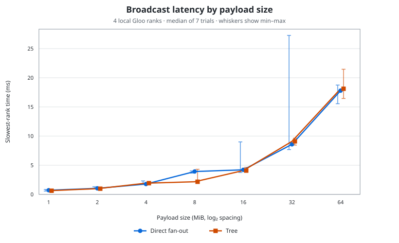

# PyTorch Distributed Phase 2: Collectives

This phase builds on Phase 0 (processes, ranks, groups, `torchrun`, Gloo) and Phase 1 (point-to-point messaging and ring-gather). Work through each exercise by drawing what every process does before running it. The communication logic is intentionally left as `# TODO: IMPLEMENT` in the code.

## 1. Goal

Understand the global problem each collective solves, who participates, where the result appears, what synchronization is involved, and how point-to-point messages could realize the same semantics. This is not an API memorization exercise.

Environment: Python 3.11+, CPU tensors, PyTorch distributed, Gloo, local `torchrun`. No accelerator or later-phase collectives are needed.

From the repository root:

```bash
uv sync --group dev
```

The commands below use the macOS loopback interface, `lo0`. On Linux, replace
`GLOO_SOCKET_IFNAME=lo0` with `GLOO_SOCKET_IFNAME=lo`.

Run examples with bounded process-group timeouts. The real subprocess tests are opt-in with `PHASE2_RUN_DISTRIBUTED=1 pytest tests/test_broadcast.py`; each subprocess also has an outer timeout. Fill in each TODO, then replace/enable the corresponding scaffold assertions.

## 2. From point-to-point to collectives

Phase 1 transferred between named peers:

```text
Rank 0 ───────────────> Rank 1
          send/recv
```

Phase 2 uses coordinated operations over a process group:

```text
          Collective operation
               Rank 0
              /  |  \
          Rank 1 Rank 2 Rank 3
```

A collective is not “rank 0 calls a function that modifies other ranks.” Every member enters a compatible operation; the runtime coordinates communication; the operation's semantics determine where results appear.

## 3. Broadcast semantics

Broadcast distributes one rank's tensor to all members of the group. The `src` rank supplies the input; all ranks, including source, call the collective. Source's tensor remains available and each non-source tensor buffer receives its contents. `src=0` is a convention in examples, not a special capability of rank zero.

`broadcast_demo.py` begins with source value 100 and placeholders elsewhere.

Run a four-rank broadcast from rank zero:

```bash
GLOO_SOCKET_IFNAME=lo0 uv run -- torchrun \
  --nnodes=1 \
  --nproc-per-node=4 \
  --master-addr=127.0.0.1 \
  --master-port=29621 \
  -m phase2.broadcast_demo \
  --src 0
```

Before the collective, rank zero has `[100]` and the other ranks have `[-1]`.
After it, every rank should have `[100]`.

Run the same experiment with rank two as the source:

```bash
GLOO_SOCKET_IFNAME=lo0 uv run -- torchrun \
  --nnodes=1 \
  --nproc-per-node=4 \
  --master-addr=127.0.0.1 \
  --master-port=29622 \
  -m phase2.broadcast_demo \
  --src 2
```

Rank two starts with `[999]`; after the collective, every rank should have
`[999]`.

Finally, delay rank two by three seconds and compare the before/after
timestamps:

```bash
GLOO_SOCKET_IFNAME=lo0 uv run -- torchrun \
  --nnodes=1 \
  --nproc-per-node=4 \
  --master-addr=127.0.0.1 \
  --master-port=29623 \
  -m phase2.broadcast_demo \
  --src 0 \
  --delay-rank 2 \
  --delay-seconds 3
```

A participant that has not entered can hold up completion. Collective
completion semantics are backend/operation-specific; do not equate broadcast
with a barrier.

## 4. Manual broadcast

Complete `manual_broadcast(tensor, src)` using only blocking `dist.send` and `dist.recv`. All world ranks call the function. Non-root processes allocate compatible buffers before calling. For P ranks and N bytes, reason about the direct source's send volume: how many copies must it send? What if rank zero must transmit a 10 GB tensor directly to 1,023 peers?

Use a fixed, agreed tensor shape and dtype. Since this function receives a tensor buffer rather than a shape descriptor, non-root buffers must already have the correct layout.

## 5. Tree broadcast

Complete `tree_broadcast` for source zero and power-of-two world size. For four ranks, double the set of informed ranks each round:

```text
step 0: R0 has X
step 1: R0 ──> R1       (R0,R1 have X)
step 2: R0 ──> R2; R1 ──> R3
final:  R0 R1 R2 R3 have X
```

Draw eight ranks and compare the number of communication rounds with naive fan-out. Do not over-optimize or benchmark localhost performance.

### Broadcast benchmark scaffold

`broadcast_benchmark.py` compares the direct fan-out and binary-tree
implementations after process-group initialization. It performs warmups,
checks the received tensor, and reports the slowest rank's elapsed time for
each trial.

Run four ranks with a one-million-element `float32` tensor (about 4 MB):

```bash
GLOO_SOCKET_IFNAME=lo0 uv run -- torchrun \
  --nnodes=1 \
  --nproc-per-node=4 \
  --master-addr=127.0.0.1 \
  --master-port=29630 \
  -m phase2.broadcast_benchmark \
  --algorithm both \
  --elements 1000000 \
  --warmups 2 \
  --trials 5
```

Repeat with `--nproc-per-node=2`, `4`, and `8`, using a fresh port for each
run. Also try several payload sizes such as `1`, `10000`, and `1000000`
elements. The tree still sends `P - 1` messages overall, but distributes those
sends across informed ranks and reduces communication depth from roughly
`P - 1` source sends to `log2(P)` rounds.

Small localhost runs may show direct fan-out winning because process
scheduling and extra tree coordination can outweigh its theoretical benefit.
Treat this as an algorithm experiment rather than evidence about multi-node
GPU performance. Native `dist.broadcast` uses backend-specific optimized
algorithms and should be the production comparison.

#### Measured local results

The following run used four local Gloo ranks on macOS, `float32` tensors, two
warmups, and seven measured trials per payload size. Times are the median of
the slowest rank in each trial.



| Payload | Direct median | Tree median | Tree improvement |
|---:|---:|---:|---:|
| 1 MiB | 0.719 ms | 0.635 ms | 11.7% faster |
| 2 MiB | 1.038 ms | 0.986 ms | 4.9% faster |
| 4 MiB | 1.779 ms | 1.925 ms | 8.2% slower |
| 8 MiB | 3.928 ms | 2.165 ms | 44.9% faster |
| 16 MiB | 4.216 ms | 4.088 ms | 3.0% faster |
| 32 MiB | 8.586 ms | 9.088 ms | 5.9% slower |
| 64 MiB | 17.789 ms | 18.107 ms | 1.8% slower |

These numbers do not consistently justify the hypothesis that tree broadcast
is faster. Tree won four of seven median comparisons, but it lost at 4, 32,
and 64 MiB, and only the 8 MiB result showed a large median advantage. The
min-max whiskers also show scheduling noise and large direct-fan-out outliers
at 16 and 32 MiB.

The theoretical claim is about scaling with the number of ranks. Direct
fan-out makes the source perform `P - 1` sequential sends, whereas this tree
uses `log2(P)` communication rounds and shares sending work among informed
ranks. This experiment held `P = 4` constant and varied only payload size, so
it cannot validate that scaling claim. On one machine, all ranks also contend
for the same CPU, memory subsystem, and loopback transport. A stronger test
would vary the world size across 2, 4, 8, and more ranks, repeat complete runs,
and ultimately measure across multiple hosts.

## 6. Reduce semantics

Reduce combines each member's corresponding tensor elements using an operator and leaves the result at the designated destination. Everyone participates. For inputs `[1,10]`, `[2,20]`, `[3,30]`, `[4,40]`, SUM to rank zero gives `[10,100]`. Do not depend on non-destination buffers after reduce.

Try `SUM`, `MAX`, `MIN`, and `PRODUCT` where backend/dtype supports them. For `1,5,3,2`, predict each result first. Reduction operators are generally expected to be associative for regrouping into efficient trees. SUM is central to aggregating gradients and metrics (we study only the semantics needed here).

## 7. Manual reduction

Complete `manual_reduce_sum` with point-to-point messages. Every rank starts with local data; the destination receives and accumulates contributions. Then complete `tree_reduce_sum` for destination zero and power-of-two world size:

```text
Round 1: R1 -> R0 (1+2=3), R3 -> R2 (3+4=7)
Round 2: R2 -> R0 (3+7=10)
```

The communication logic and accumulation are intentionally TODOs. Compare code complexity, explicit message count, synchronization reasoning, scalability, maintainability, and algorithm/backend optimization opportunities with native collectives. This is a semantic comparison, not a Mac networking benchmark.

## 8. Barrier

`dist.barrier()` makes each member wait until all members of its group reach that point. It does not copy tensors or make Python objects identical. `barrier_demo.py` delays ranks by 0, 1, 2, and 4 seconds and records before/after timestamps and wait duration. Predict when the fastest rank proceeds. A slow worker can make every faster worker idle at a synchronization point: the straggler problem.

## 9. Synchronization vs communication

Broadcast and reduce move/transform application data. Barrier establishes a coordination point. For example, rank-local tensors `[0]`, `[1]`, `[2]`, `[3]` stay different after a barrier. Synchronization is not data exchange.

## 10. Process groups

The default world is one group; `dist.new_group` creates other membership sets. Complete `create_pair_groups()` and subgroup broadcast for `{0,1}` and `{2,3}`. All world ranks must create groups in compatible order, while only members call a subgroup collective. Group A's barrier does not require ranks 2 and 3. Smaller groups later support communication among selected tensor, pipeline, or expert parallel workers.

## 11. Collective ordering

Within a group, ranks must execute compatible collectives in compatible order. If some ranks do Broadcast then Reduce while another does Reduce then Broadcast, operations can mismatch, error, or time out. A rank skipping a collective has similar consequences. `failures.py` provides bounded ordering, missing participant, shape, and dtype experiments; backend behavior varies, so protocol violations can produce errors, timeouts, or hang-like behavior.

## 12. Failure modes

Treat every collective as a distributed protocol with shared assumptions: group membership, call order, root, tensor shape, and dtype. Do not assume mismatches always produce a clean Python exception. Use finite process-group and test timeouts. The negative examples are experiments, not production patterns.

## 13. Training-related examples

- Broadcast: rank zero owns tensor-encoded configuration (seed and step count), then all workers receive it.
- Reduce: each worker contributes loss sum and example count; rank zero gets global totals and computes total loss / total examples. Do not average local means unless every rank has equal example counts.
- Rank-zero logging: reduce fits when only one process needs the aggregate.
- Barrier: establish a phase boundary, understanding that the slowest worker governs progress.

`tracing.py` defines a small JSON event record (`rank`, operation, group, tensor shape, timestamp, phase), with no logging framework.

## 14. Capstone: mini coordinator

Complete `algorithms.run_capstone()` using only broadcast, barrier, and reduce. Rank zero starts with seed 123 and 5 steps; every rank performs deterministic, rank-varying toy work; all synchronize before metric aggregation; rank zero prints JSON with world size, total examples, and global mean loss. The scaffold uses counts 1,2,3,4 and per-rank loss sums `(rank+1)*5`, so expected totals are 10 examples and mean loss 5.0. Explain the flow as one-to-many, everyone waits, many-to-one.

## 15. Paper-and-pencil exercises

1. With R0=[5], R1=[9], R2=[2], R3=[7], what does every rank hold after broadcast from rank 2?
2. With those same inputs, what does rank 3 hold after SUM reduce to rank 3? Which rank is guaranteed the final result?
3. Explain the directional difference between broadcast and reduce.
4. Rank 0 reaches a barrier at t=1s and rank 3 at t=8s. When can rank 0 continue, approximately? What does this show about stragglers?
5. With 1,024 ranks and a 1 GB tensor, why could direct root-to-everyone sending be undesirable? What topology may improve scalability?

Fill in before looking up the semantics:

| Operation | Input location | Result location |
|---|---|---|
| Broadcast | ? | ? |
| Reduce | ? | ? |

## 16. Questions and interview checkpoint

Answer these after the exercises, without looking at the code:

1. What makes an operation collective? Does one rank calling broadcast cause it automatically? Which ranks participate?
2. What does `src` mean? Is rank zero special? What happens to source and non-source buffers?
3. How can send/recv implement broadcast? Why does naive fan-out scale poorly? How does a tree reduce communication depth?
4. What does reduce do, where is its result, and why are other ranks' output buffers unspecified?
5. What is a reduction operator? Why is associativity useful? Why is SUM common in ML?
6. What does barrier guarantee? Does it move tensors? Why do stragglers matter?
7. Why must ranks use compatible collective order? What can happen if one rank skips or tensors disagree in shape/dtype?
8. What is a process group? Can groups run independent collectives? Why will subgroups matter for tensor, pipeline, and expert parallelism?
9. Why might global metrics use reduce? When would broadcast be natural?
10. How would you choose between a manual send/recv protocol and a native collective?

Senior MLE prompts:

- 64 workers need a seed loaded by rank zero: what pattern fits?
- Every rank counts successful examples and only rank zero logs the global count: what pattern fits and why?
- R0: Broadcast→Reduce; R1: Broadcast→Reduce; R2: Reduce→Broadcast; R3: Broadcast→Reduce. What protocol problem do you expect?
- Why can a low-payload barrier be slow? Why can one slow worker limit synchronous training throughput?
- Why use groups `{0..3}` and `{4..7}`?
- Why might a tree broadcast beat root direct fan-out?
- Predict the semantic difference between Reduce and AllReduce. Do not implement any later-phase operation.
- Draw an eight-rank point-to-point broadcast and an eight-rank reduction tree, showing every round.

Mandatory derivations before Phase 2 is complete: draw broadcast propagation from R0 to seven peers; draw reduction in reverse; draw a barrier timeline with an early rank waiting for the last arrival. Do not move to Phase 3 until you can derive these patterns on paper.
